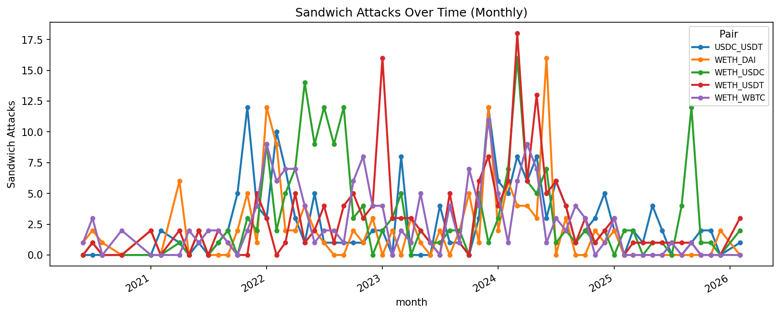
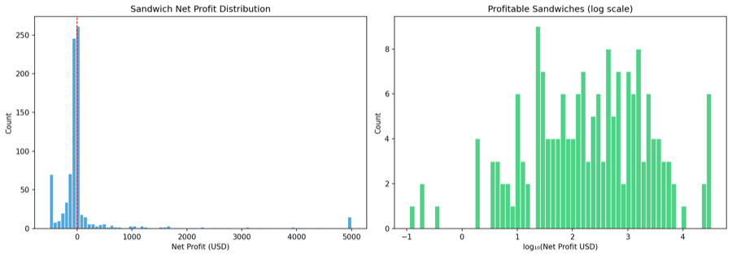
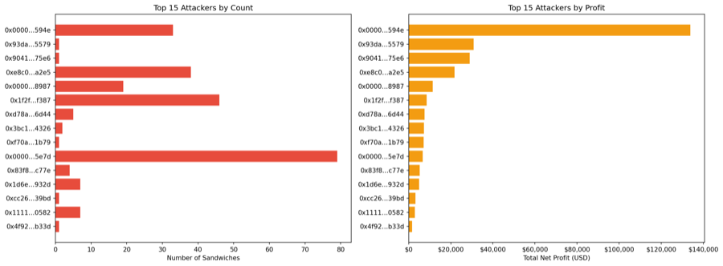

# MEV Frontrunning Analysis Report

## 1. Introduction

Maximum Extractable Value (MEV) refers to the additional value that can be captured by influencing transaction ordering during block construction. On automated market maker (AMM) protocols such as Uniswap V2, the outcome of a swap depends not only on pool reserves and trade size, but also on where the transaction appears within the block. Transaction ordering is therefore economically meaningful and creates room for strategies such as frontrunning, back-running, and sandwiching. This project examines MEV-related behavior on Uniswap V2 using historical Ethereum mainnet event logs. The analysis focuses on five major trading pairs: WETH_USDC, WETH_USDT, WETH_DAI, WETH_WBTC, and USDC_USDT. Based on structured swap records reconstructed from on-chain event data, the study identifies four suspicious patterns: sandwich attacks, displacement frontrunning, arbitrage / back-running, and suppression. The goal is not to infer intent from isolated transactions. Instead, the report develops a reproducible workflow for studying ordering-sensitive behavior on AMM markets. By combining swap ordering, gas-price signals, and profit-related estimates, the analysis evaluates how closely the observed patterns align with known MEV strategies.


## 2. System Workflow

The analysis is organized as a four-stage pipeline: data acquisition, data loading and preprocessing, MEV pattern detection, and post-analysis. In the first stage, historical Uniswap V2 Swap and Sync event logs are collected from the Ethereum mainnet for the target trading pairs. In the second stage, the collected data are loaded from pair-specific CSV files, numeric fields are cleaned, transactions are ordered by block position, and trader entities are heuristically identified. In the third stage, the detector scans block-level swap sequences and applies four rule-based heuristics to identify sandwich attacks, displacement frontrunning, arbitrage / back-running, and suppression. In the fourth stage, after detection, the system estimates profits where possible, analyzes gas-price behavior, summarizes pair-level statistics, and generates charts and export files. Even without mempool data, this workflow provides a practical basis for comparing suspicious transaction-ordering patterns across major Uniswap V2 pairs. That limitation still matters, but ordered on-chain logs are sufficient to support a meaningful comparative analysis.

```
Dataset Crawler  →   4 MEV Detectors  →  Profit Analyzer  →  Charts + Excel
```


## 3. Data Collection and Processing

### 3.1 Crawler Outcome 

The crawler is implemented in Python (`uniswap_fetcher/`) and uses Etherscan's `getLogs` API to collect Uniswap V2 pair events from the Ethereum main network. This section no longer emphasizes the API mechanism, but summarizes the result data set.

The crawler covers the period from the early history of Uniswap V2 to March 2026, covering **14,639,489 blocks**. A total of **2,690,493** original logs were obtained, and **2,690,473** decoding records were retained after filtering and normalization. The five pairs of trading combinations included in the analysis are 'WETH_USDC', 'WETH_USDT', 'WETH_DAI', 'WETH_WBTC' and 'USDC_USDT'.

Under key rotation, rate limit and retry control, the whole collection process is completed within about **8 hours**. In order to support reprodacibility, the data obtained is also published on Kaggle for independent verification: 
**https://www.kaggle.com/datasets/chickenbilibili/uniswapv2-exchange-history**

 The decoded logs are exported to `Swap`, `Sync`, `Mint` and `Burn` CSV files under `data/<PAIR_NAME>/`.

**Pair contracts configured for this project** (each row is one `UniswapV2Pair` deployed address):

| `name` (output folder) | Pair contract (checksummed / config as stored) |
|------------------------|-----------------------------------------------|
| `WETH_USDC` | `0xB4e16d0168e52d35CaCD2c6185b44281Ec28C9Dc` |
| `WETH_USDT` | `0x0d4a11d5EEaaC28EC3F61d100daF4d40471f1852` |
| `WETH_DAI` | `0xA478c2975Ab1Ea89e8196811F51A7B7Ade33eB11` |
| `USDC_USDT` | `0x3041CbD36888bECc7bbCBc0045E3B1f144466f5f` |

The default **maximization** mode starts from near the Uniswap V2 factory deployment (`maximize_from_block: 10000835`) and continues to move towards the tip of the chain, unless a limited `(from_block, to_block)` range is specified in `config.yaml`.


The project uses four Uniswap V2 event types:

**Swap**: Record the token exchange activity and use it as the main input for MEV detection.

**Sync**: Record reserve updates and support reserve tracking and ETH price reconstruction.

**Mint**: Record the increase in liquidity.

**Burn**: Record the removal of liquidity.


### 3.2 Entity Identification

Effective transaction entities are defined by heuristics. This does not completely solve the problem of attribution, but it is a reasonable compromise to group the router-mediated exchange under the participants most directly involved in the transaction results.

### 3.3 Transaction Sorting and Direction Allocation

In order to reconstruct the execution order inside each block, the exchange is sorted by `block_number`, `tx_index` and `log_index`. Formally, the order in the block of the transaction is represented as:

$$
\mathrm{ord}(x) = (\mathrm{txIndex}_x,\ \mathrm{logIndex}_x)
$$

The sorting is the main part of the analysis, because every detection rule depends on the relative position of the exchange operation in the same piece.


For every exchange, we clearly state a binary direction:

`direction = 0`: token0 flows to pair

`direction = 1`: token1 flows to pair

When the input end is clear, the direction can be inferred directly from the non-zero input field. Otherwise, compare the decimal normalized mark input so that different mark units will not distort the directional distribution.

### 3.4 Price Reconstruction and Valuation Setup

To estimate profits in US dollars, we set a historical ETH price index based on Uniswap V2 reserves. It first uses `WETH_USDC` to retain data. If this pair is not available, go back to `WETH_USDT`, and then `WETH_DAI`.

Stablecoins such as `USDC`, `USDT` and ``DAI` are directly regarded as dollar-denomination assets. 'WETH` uses the reconstructed ETH price sequence for conversion. WBTC" is valued by the dynamic BTC/ETH ratio derived from the "WETH_WBTC" pool reserves, which is more suitable for historical analysis than using fixed approximation.

### 3.5 Output Summary

Before the detector is executed, the crawler will generate the following records:  **Sync**: 1,349,490；**Swap**: 1,315,097；**Mint**: 13,381；**Burn**: 12,505；**Total**: **2,690,473**.

The output results of the detectors include: **845** interlayer events; **845** sandwich events；**758** displacement events；**3,593** arbitrage / back-running events；**18** suppression events.


**Figure 1.** Detected frontrunning activities by type and trading pair.

These test results constitute the empirical basis for later discussing profitability, gasoline price behavior and cross-differences.


## 4. Detection Method

### 4.1 Sandwich Attacks

#### 4.1.1 Intuition

A sandwich attack happens when a single entity trades right before a victim transaction and then trades again immediately after it within the same block. In this scenario, the first trade opens a position, the victim transaction moves the AMM price, and the attacker’s second trade closes the position after that price movement. Essentially, the attacker is trying to profit from the price impact created by the victim’s trade.

#### 4.1.2 Implementation Logic

In order to detect this attack, the system first finds out the block containing at least three exchange transactions and at least one duplicate user. In each block, the transaction will be grouped by user, and then the algorithm will look for two transactions in opposite directions from the same user. When the same user appears at least twice in the block, and the two transactions are opposite and not the same transaction, it will be marked as a potential sandwich attack. In addition, at least one exchange operation from a different entity must be located between the two exchange operations in the execution order, and the direction of this intermediate exchange operation must be consistent with the direction of the attacker's first transaction. In this way, the classic "front transaction → victim transaction → return transaction" mode can be captured directly from the orderly exchange data.

#### 4.1.3 Profit Calculation Logic

For each detected sandwich transaction event, the project will calculate the attacker's net token income in the previous transaction and the next transaction. Suppose that after completing these two transactions, the attacker's net token balance is `net_token0` and `net_token1` respectively. Then, these balances will be converted into US dollars according to the specific valuation rules of the token. The total profit can be expressed as

$$
\mathrm{ProfitUSD} = \mathrm{USD}(n_0) + \mathrm{USD}(n_1)
$$

and the gas cost is estimated using a fixed model of 150,000 gas per swap:

$$
\mathrm{GasCostUSD} = \frac{(g_{\mathrm{front}} + g_{\mathrm{back}}) \times 150000}{10^{18}} \times P_{\mathrm{ETH}}(B)
$$

Finally, the net profit is calculated by subtracting the gas cost from the gross profit:

$$
\mathrm{NetProfitUSD} = \mathrm{ProfitUSD} - \mathrm{GasCostUSD}
$$


#### 4.1.4 Findings

A total of **845** sandwich attacks were detected. Among them, the estimated net profit of **179** was positive, that is, the profit cases accounted for about **21.2%** of the total number of sandwiches detected. Overall, the gross profit of these attacks was **668,920.24**, while the net profit after the cost of natural gas was **194,984.86**. The average net profit and median per attack were **230.75** and **-23.27**, respectively. These figures show that the profits of sandwiches are obviously uneven, rather than widely distributed. Once the cost of natural gas is included, many of the discovered cases will become very small, even negative, while a group of smaller and profitable events account for a large part of the total benefits.

Taking a single transaction pair as an example, the number of detected sandwiches is summarised in the following table:

| Pair | Sandwiches | % Blocks | % Volume |
|------|-----------|---------|---------|
| WETH_USDC | 201 | 0.08% | 0.19% |
| WETH_USDT | 178 | 0.08% | 0.19% |
| WETH_DAI | 133 | 0.05% | 0.14% |
| WETH_WBTC | 164 | 0.09% | 0.25% |
| USDC_USDT | 169 | 0.07% | 0.21% |

#### 4.1.5 Figures

The following figures help illustrate the sandwich attacks detected in this study.



**Figure 2.** Monthly sandwich counts across the five analyzed trading pairs.



**Figure 3.** Distribution of sandwich net profit, showing a strong right tail and many low-profit or negative outcomes after gas costs.



**Figure 4.** Top sandwich attackers ranked by event count and total estimated net profit.


### 4.2 Displacement Frontrunning

#### 4.2.1 Intuition

Displacement frontrunning occurs when a trader uses higher gas fees to get their transaction executed before another user’s transaction that is trying to perform a similar trade. By taking priority in the block, the earlier transaction can negatively affect the execution outcome of the later trader, such as causing worse price or higher slippage.

#### 4.2.2 Implementation Logic

The detector will scan each pair of transactions in the same block and mark the displacement event when several conditions are met. First of all, these two transactions must come from different entities, and they must move in the same direction. The first transaction must be executed earlier in the block, which means that its `tx_index` must be strictly smaller than the `tx_index` of the second transaction, and the two transactions should be separated by five positions. In addition, the gas-price ratio of the transaction must meet

$$
\frac{g_f}{g_v} \ge 1.5
$$

where the first transaction is considered the potential frontrunner and the later transaction the potential victim.

It should be noted that this method provides the same block heuristic algorithm, not a direct proof of preemptive trading. Due to the lack of available memory pool data, the detector cannot determine whether the subsequent traders intended to trade first. What it can reveal, however, is a repeated pattern of close-proximity, same-direction trades in which one transaction has a significant gas-price advantage over the other.

#### 4.2.3 Value / Profit Interpretation

Compared with sandwich attacks, displacement attacks are more difficult to evaluate, because their results depend on a counter-factual problem: how bad is the subsequent transaction because of the loss of priority? Therefore, this report does not regard the displacement profit as a direct profit like a completed sandwich attack.

However, the code does estimate the economic effect of this sorting advantage. It will report several key indicators, including the dollar value of the frontrunner exchange, the dollar value of the victim transaction exchange, the estimated Gas cost of the front transaction, the estimated loss of the victim transaction under the counter-factual benchmark, and the loss extrapolated from it. Estimate the profit signal.

Therefore, it is necessary to be cautious when interpreting these results. Displacement attack is best understood as a ranking advantage model with estimated economic impact, rather than clearly available arbitrage gains.

#### 4.2.4 Findings

Judging from the gas ratio statistics, these displacement events show obvious bias. There are a total of **758** incidents, and the median Gas ratio of pre-trades and victim transactions is **3.2×**. The transaction pairs involved include WETH_USDC, WETH_USDT, WETH_DAI, WETH_WBTC and USDC_USDT. There is a big gap between ordinary cases and extreme cases. A few extremely high Gas ratios increase the average, while the median can more stably reflect the typical priority bidding situation of the same block.

The top five displacement front traders are as follows:


| Entity | Events |
|--------|--------|
| `0xfbd4cdb4…794c37` | 82 |
| `0x66a9893c…dba8af` | 79 |
| `0x3328f7f4…309c49` | 58 |
| `0x3fc91a3a…2b7fad` | 21 |
| `0x80a64c6d…cd5d9e` | 20 |

#### 4.2.5 Figure


**Figure 5.** Distribution of displacement gas ratios and pair-level event counts.


### 4.3 Arbitrage / Back-running

#### 4.3.1 Intuition

Arbitrage / back-running occurs when the trader reacts immediately after a large transaction that has changed the price of the pool. Triggering transactions will cause temporary price fluctuations, and return traders take advantage of this imbalance to profit from exchanges in opposite directions.

#### 4.3.2 Implementation Logic

The detector first calculates the transaction scale index for each exchange, which takes the larger of the normalised values of the two tokens input. If the scale of an exchange exceeds the 90th percentige of the trading pair, it is regarded as a trigger transaction:

$$
S(t) \ge Q_{0.90}(S)
$$

For each triggered transaction, the detector will look for subsequent exchanges in the same block and check three conditions: the transaction must belong to a different entity, the transaction direction must be opposite, and it must be completed in the next three transaction positions. If all these conditions are met, the subsequent transaction will be recorded as an arbitrage or back-running event.

This rule aims to capture the transaction behaviour of large transactions that respond immediately, rather than a more complex multi-step arbitrage path. In practical applications, it can highlight traders who respond quickly to price changes in the same block.

#### 4.3.3 Profit Calculation Logic

For each detected back-runner, the project will calculate the net token output of its reaction transaction and convert it into US dollars. In order to avoid cyclic pricing, the system uses the ETH price of the previous block as a fair market reference, because the trigger transaction of the current block has changed the pool reserve and distorted the price in the same block.

If the number of tokens obtained from the reposition transaction exceeds the amount paid, the difference shall be used as the estimated profit. Then, the gross profit is subtracted from the estimated Gas cost to obtain the net profit:

$$
\mathrm{NetProfitUSD} = \mathrm{ProfitUSD} - \mathrm{GasCostUSD}
$$

Among them

$$
\mathrm{GasCostUSD} = \frac{g_{\mathrm{back}} \times 150000}{10^{18}} \times P_{\mathrm{ETH}}^{\mathrm{pre}}(B)
$$

Here,$P_{\mathrm{ETH}}^{\mathrm{pre}}(B)$ represents the ETH price of the previous block $B$, which is used as a market reference that is not affected by the current block transaction.

This method provides a viable profit estimate to compare the arbitrage opportunities in different trading pairs.

#### 4.3.4 Findings

A total of **3,593** arbitrage/back-running events were detected, making it the most frequent suspicious mode in the data set.

The estimated profits of these events are very considerable. There were a total of 3,593 return transactions, with a total net profit of **9,895,543.96** and an average net profit of **2,754.12** per transaction.

The following is the list of the top five return traders:

| Entity | Events |
|--------|--------|
| `0xa69babef…56e78c` | 210 |
| `0xa57bd001…fdd6cf` | 179 |
| `0x6b75d8af…009a80` | 153 |
| `0x51c72848…502a7f` | 141 |
| `0x860bd2db…d78f66` | 120 |

In terms of frequency and total estimated profit, reposition transactions dominate the data set. This model is in line with the AMM market structure: large exchanges will cause short-term local imbalances, and traders who can respond quickly within the same block can usually quickly use these imbalances to make profits.

#### 4.3.5 Figure


**Figure 6.** Estimated net-profit distribution and pair-level counts for detected arbitrage / back-running events.


### 4.4 Suppression

#### 4.4.1 Intuition

Suppression refers to a behavior at the block level, in which an entity submits multiple high-gas exchange transactions in the same block, which may crowd out the space of other market participants or dominate the block execution.

#### 4.4.2 Implementation Logic

The detector first calculates the median Gas price of each block. Then, it aggregates the exchange transaction by `(block_number, entity)` and marks it as a suppression candidate event when certain conditions are met. Specifically, if an entity submits at least three exchange transactions in the same block, and the entity's medin Gas price is at least three times the median of the block, it will be considered a candidate event.

In the formula, the Gas premium threshold is defined as:

$$
\mathrm{GasPremium} = \frac{\mathrm{EntityMedianGas}}{\mathrm{BlockMedianGas}} \ge 3.0
$$

It should be noted that this detector is heuristic. Its purpose is to identify abnormally radical Gas bidding behaviour in the same block, rather than proving that it directly caused the victim's loss in each case.

#### 4.4.3 Value / Profit Interpretation

Suppression cannot directly recover the achievable net profit formula by exchanging logs alone. Therefore, its economic effect is more indirect than sandwich attacks or reposition transactions. The entity that implements suppression may be protecting other strategies, suppressing nearby competitors, or taking advantage of short-term block-level sorting advantages.

Therefore, this report mainly explains the suppression behaviour through **gas premium**, **swap concentration**, and **block dominance**, rather than through precise realised net profits.

#### 4.4.4 Findings

Only **18** suppression events were detected in total, making it the least common pattern in the data set. Although the quantity is small, the Gas premium signal is very strong, and the median Gas premium reaches **20.5×**. The distribution is obviously right-biased, and a few extreme events have increased the average, indicating that these inhibition events are extremely radical in Gas price competition.

The five most active suppressors in the dataset are shown in the table below:

| Entity | Events |
|--------|--------|
| `0x6b75d8af…009a80` | 10 |
| `0x1f2f10d1…6df387` | 3 |
| `0x00000000…120e49` | 1 |
| `0x3328f7f4…309c49` | 1 |
| `0x7c63795c…bcfde8` | 1 |

#### 4.4.5 Figure


**Figure 7.** Gas-premium distribution and pair-level counts for detected suppression events.


## 5. Gas Price Analysis

Natural gas price is one of the most important priority indicators for on-chain transactions. Since the MEV strategy largely depends on the order of execution, natural gas price behavior provides supporting evidence for strategic bidding and intra-block competition.

In this project, the analysis of natural gas prices compared the gas price patterns in the suspect areas and the normal areas, particularly regarding activities related to sandwiches. Through a 2:2 comparison, it was found that the median gas price in the suspect areas was typically significantly higher than that in the normal areas.This premium is moderate in some pairs, but very large in others, indicating the intensity of natural gas competition in different markets.

Judging from the generated gas diagram, the main mode is very clear:

"WETH_USDC" and "WETH_USDT" show a slight increase in the price of natural gas in sandwich-related blocks.

`WETH_DAI`, `WETH_WBTC` and `USDC_USDT` show a greater natural gas premium.

This supports the view that natural gas price competition is an important support signal for mev-related activities, especially sandwich attacks and similar suppression behaviors.

Gas analysis enhances the broader interpretation of detected events. Suspicious transaction patterns not only occur during the transaction process, but also frequently appear in the gas prices paid to suppliers, with the aim of ensuring priority supply rights.

### Figure


**Figure 8.** Median gas price in sandwich-related blocks versus normal blocks across the analyzed pairs.


## 6. Conclusion

The project uses the historical event data of the Ethereum main network to build a complete workflow for detecting and analyzing advance transaction behaviors related to MEV on Uniswap V2. By combining structured transaction orders, heuristic entity identification, and follow-up analysis of profits and gas prices, the system converts the original event logs into explainable evidence of suspicious transaction order behavior.

These four market effect models have obvious different characteristics: **arbitrage/reverse follow-up** is the most common and profitable mode; **pinch attack** is rare, but the profit concentration is high; **substitutional early trading** is an order advantage caused by gas differences, not a pure arbitrage behavior; and **suppression** is rare, but has a very high gas premium characteristics.

Although there are certain limitations in the transparency of the trading pool and some intuition-based assumptions, the analysis of ordered transaction data and transaction fee behavior provides a reliable and repeatable framework for the study of transaction sequences in Uniswap V2.
