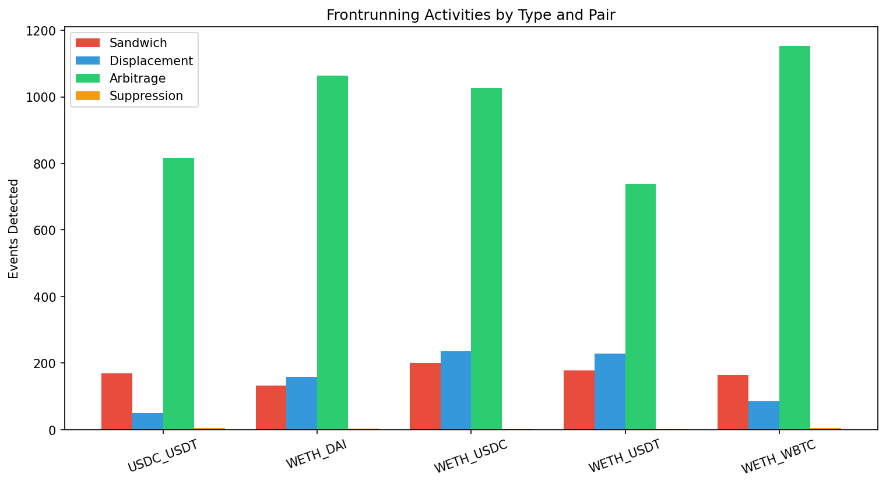
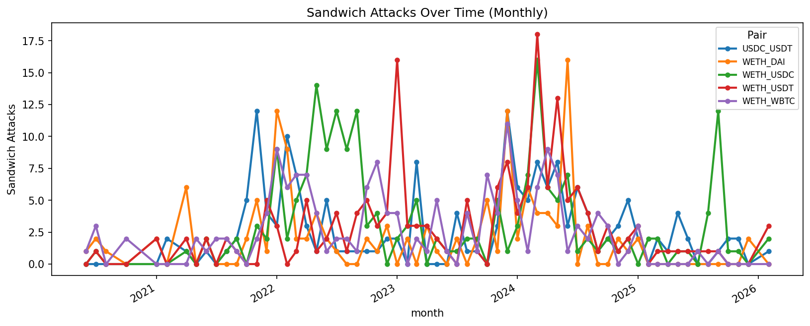
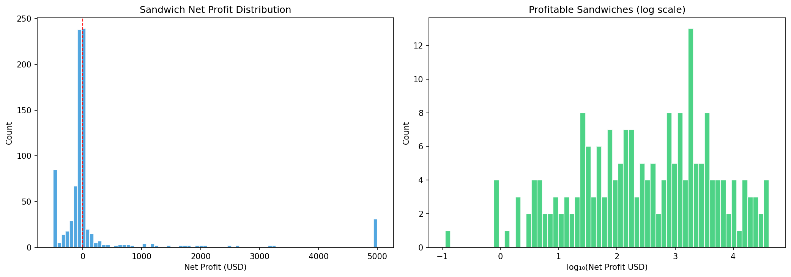
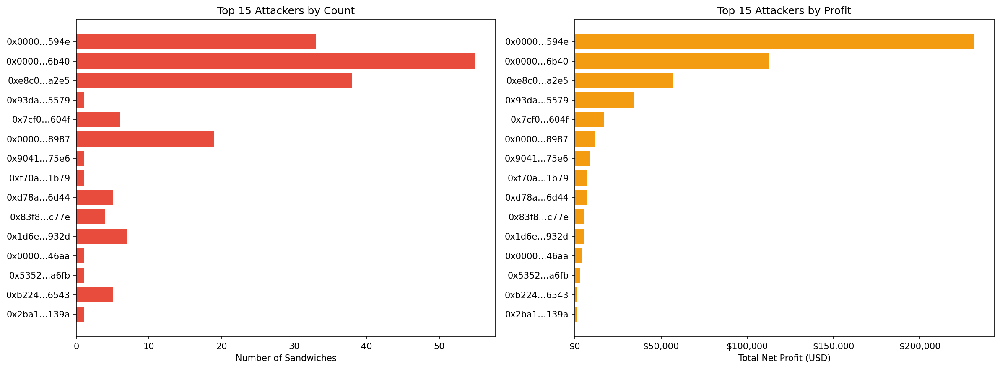
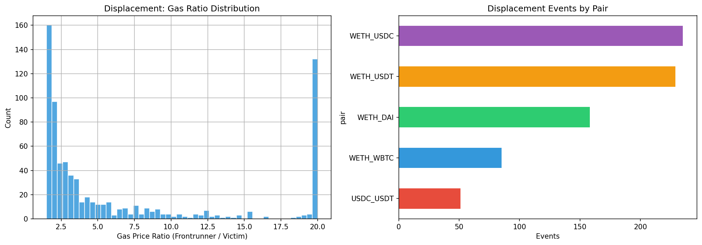
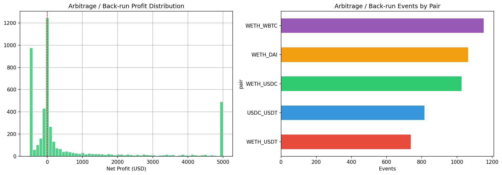
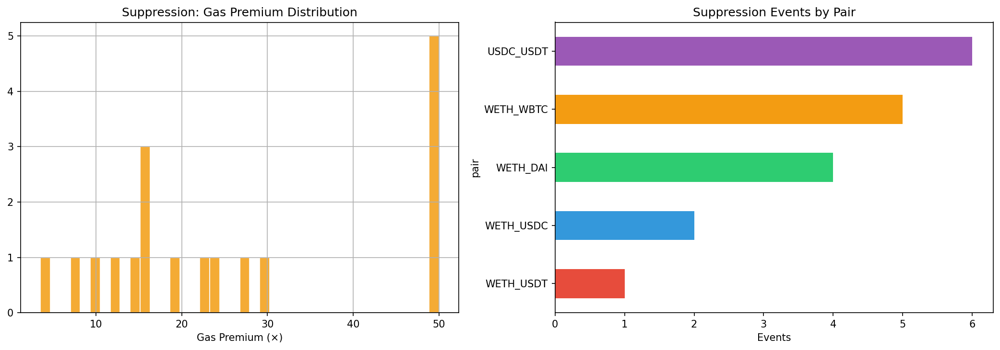
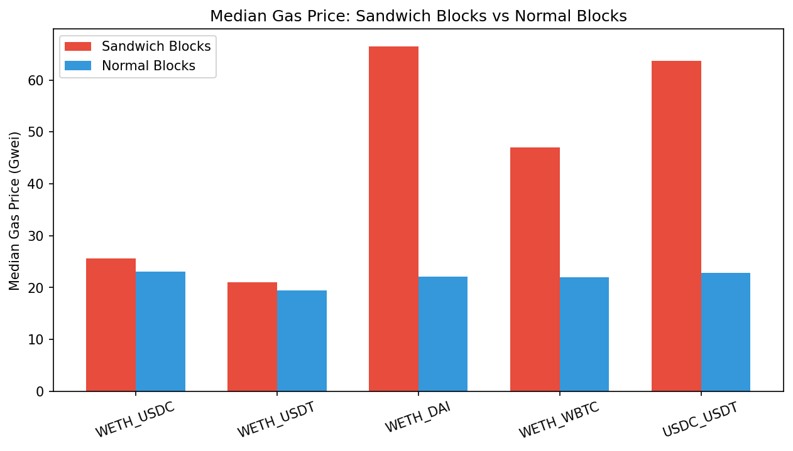
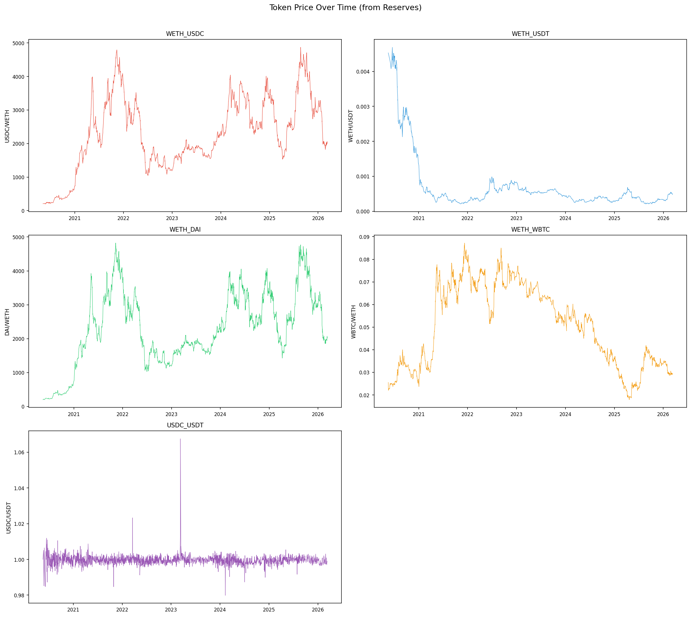

# MEV Frontrunning Analysis Report
*Generated: 2026-03-17 15:41:37*

## 1. Executive Summary

- **Total swap transactions analysed**: 1,315,097
- **Trading pairs**: WETH_USDC, WETH_USDT, WETH_DAI, WETH_WBTC, USDC_USDT

| Frontrunning Type | Events Detected |
|-------------------|----------------|
| Sandwich (Insertion) | 845 |
| Displacement | 758 |
| Arbitrage / Back-run | 4,796 |
| Suppression | 18 |
| **Total** | **6,417** |

- Sandwich net profit: **$402,379.84**
- Arbitrage net profit: **$17,024,829.75**
- Unique sandwich attackers: **83**



## 2. Sandwich Attacks (Insertion)

A sandwich attack places a **front-run** trade before and a **back-run** trade after a victim's swap in the same block, profiting from the price movement caused by the victim.

| Pair | Sandwiches | % Blocks | % Volume |
|------|-----------|---------|---------|
| WETH_USDC | 201 | 0.08% | 0.19% |
| WETH_USDT | 178 | 0.08% | 0.19% |
| WETH_DAI | 133 | 0.05% | 0.14% |
| WETH_WBTC | 164 | 0.09% | 0.25% |
| USDC_USDT | 169 | 0.07% | 0.21% |

- Profitable: **206** / 845 (24.4%)
- Gross profit: **$877,638.22**
- Net profit: **$402,379.84**
- Avg / Median net: $476.19 / $-23.06

### Top 10 Sandwich Attackers

| Attacker | Count | Net Profit (USD) |
|----------|-------|-----------------|
| `0x00000000…0f594e` | 33 | $231,432.98 |
| `0x00000000…416b40` | 55 | $112,393.30 |
| `0xe8c060f8…38a2e5` | 38 | $56,577.63 |
| `0x93dabae1…955579` | 1 | $34,264.40 |
| `0x7cf09d7a…d1604f` | 6 | $16,937.66 |
| `0x00000000…4e8987` | 19 | $11,418.62 |
| `0x90414447…b275e6` | 1 | $9,086.68 |
| `0xf70a5d55…511b79` | 1 | $7,125.03 |
| `0xd78a3280…486d44` | 5 | $7,031.14 |
| `0x83f893cc…dec77e` | 4 | $5,638.26 |





## 3. Displacement Frontrunning

Displacement occurs when a frontrunner observes a pending swap and submits their own transaction **in the same direction** with a **higher gas price**, getting executed first and leaving the victim with a worse price.

- Total displacement events: **758**
- Avg gas ratio (frontrunner / victim): **2258.79×**
- Pairs: WETH_USDC, WETH_USDT, WETH_DAI, WETH_WBTC, USDC_USDT

### Top 5 Displacement Frontrunners

| Entity | Events |
|--------|--------|
| `0xfbd4cdb4…794c37` | 82 |
| `0x66a9893c…dba8af` | 79 |
| `0x3328f7f4…309c49` | 58 |
| `0x3fc91a3a…2b7fad` | 21 |
| `0x80a64c6d…cd5d9e` | 20 |



## 4. Arbitrage / Back-running

Back-running occurs when an entity detects a large swap and immediately trades in the **opposite direction** to profit from the price reversion after the large trade's impact.

- Total back-run events: **4,796**
- Net profit: **$17,024,829.75**
- Avg net profit: **$3,549.80**

### Top 5 Back-runners

| Entity | Events |
|--------|--------|
| `0xa57bd001…fdd6cf` | 332 |
| `0xa69babef…56e78c` | 262 |
| `0x51c72848…502a7f` | 181 |
| `0x860bd2db…d78f66` | 175 |
| `0x6b75d8af…009a80` | 175 |



## 5. Suppression

Suppression involves an entity flooding a block with **many high-gas transactions**, crowding out normal users and/or delaying their txs.

- Total suppression events: **18**
- Avg gas premium: **907.1×**

### Top 5 Suppressors

| Entity | Events |
|--------|--------|
| `0x6b75d8af…009a80` | 10 |
| `0x1f2f10d1…6df387` | 3 |
| `0x00000000…120e49` | 1 |
| `0x3328f7f4…309c49` | 1 |
| `0x7c63795c…bcfde8` | 1 |



## 6. Gas Price Analysis

| Pair | Sandwich Block Gas | Normal Block Gas | Premium |
|------|-------------------|-----------------|---------|
| WETH_USDC | 25.67 Gwei | 23.05 Gwei | +11.4% |
| WETH_USDT | 20.99 Gwei | 19.42 Gwei | +8.1% |
| WETH_DAI | 66.48 Gwei | 22.09 Gwei | +201.0% |
| WETH_WBTC | 47.00 Gwei | 22.00 Gwei | +113.6% |
| USDC_USDT | 63.65 Gwei | 22.84 Gwei | +178.6% |




## 7. Engineering Efforts

We built our own Python crawler to collect UniswapV2 history automatically. This was important because our MEV analysis needed large amounts of ordered transaction data, not just a few manually exported files.

### What We Collected

- Blockchain: Ethereum mainnet
- Protocol: UniswapV2 pair contracts
- Start point: block `10000835`
- Main pairs:

```yaml
pairs:
  - address: "0xB4e16d0168e52d35CaCD2c6185b44281Ec28C9Dc"
    name: "WETH_USDC"
  - address: "0x0d4a11d5EEaaC28EC3F61d100daF4d40471f1852"
    name: "WETH_USDT"
  - address: "0xA478c2975Ab1Ea89e8196811F51A7B7Ade33eB11"
    name: "WETH_DAI"
  - address: "0xBb2b8038a1640196FbE3e38816F3e67Cba72D940"
    name: "WETH_WBTC"
  - address: "0x3041CbD36888bECc7bbCBc0045E3B1f144466f5f"
    name: "USDC_USDT"
```

### What Each Crawled Event Means

- `Swap`: a user trade happened
- `Sync`: the pool reserves changed
- `Mint`: liquidity was added
- `Burn`: liquidity was removed

```python
SWAP_TOPIC = "0xd78ad95fa46c994b6551d0da85fc275fe613ce37657fb8d5e3d130840159d822"
SYNC_TOPIC = "0x1c411e9a96e071241c2f21f7726b17ae89e3cab4c78be50e062b03a9fffbbad1"
MINT_TOPIC = "0x4c209b5fc8ad50758f13e2e1088ba56a560dff690a1c6fef26394f4c03821c4f"
BURN_TOPIC = "0xdccd412f0b1252819cb1fd330b93224ca42612892bb3f4f789976e6d81936496"
```

### How We Stored the Data

- We saved one folder per trading pair
- We saved one CSV file per event type
- We kept a checkpoint file so the crawler could continue after stopping
- We kept an error log for timeouts and API problems

```text
data/
  checkpoint.json
  error.log
  WETH_USDC/
    swaps.csv
    syncs.csv
    mints.csv
    burns.csv
```

### Example Output

- `swaps.csv` records the exact position of a trade in a block

```csv
block_number,tx_hash,tx_index,log_index,timestamp,sender,to,amount0_in,amount1_in,amount0_out,amount1_out,gas_price
```

- `syncs.csv` records the pool reserves after a change

```csv
block_number,tx_hash,tx_index,log_index,timestamp,reserve0,reserve1
```

### Practical Problems We Had to Solve

- API limit problem:
  - Etherscan limits how many requests one key can send
  - We solved this by rotating across multiple API keys

```python
limiter = RateLimiter(
    api_keys=api_keys,
    calls_per_second=cfg.calls_per_second,
    daily_limit=cfg.daily_limit,
)
```

- Unstable network / server problem:
  - Some requests fail because of timeout, rate limit, or busy server
  - We retry automatically instead of stopping the whole job

- Large history problem:
  - Some block ranges contain very few events, while others contain many
  - We changed the query size dynamically to crawl faster without missing data

```python
if num_events < 500:
    step *= 3.5
elif num_events < 900:
    step *= 3
else:
    step *= 2.5
```

- Long-running job problem:
  - Crawling historical data can take hours or days
  - We save progress continuously so the next run can resume

```json
{
  "0xb4e16d0168e52d35cacd2c6185b44281ec28c9dc": {
    "pair_name": "WETH_USDC",
    "last_block": 19123456,
    "event_counts": {
      "swap": 123456,
      "sync": 123456
    }
  }
}
```

### Why This Was Important

- We needed `tx_index` and `log_index` to know the exact order of trades inside one block
- We needed `gas_price` to study who paid more gas to get priority
- We needed `Sync` events to reconstruct how pool reserves changed over time
- We needed a clean CSV structure so the later detection code could run repeatedly and reproducibly

## 8. Methodology & Limitations

### Detection Algorithms

1. **Sandwich (Insertion)**: Same block, same entity executes two swaps in opposite directions with ≥ 1 victim swap (same direction as front-run) between them.
2. **Displacement**: Same block, same direction, different entities; frontrunner pays ≥ 1.5× gas price of victim and executes first (within 5 tx positions).
3. **Arbitrage / Back-run**: Within 3 tx positions after a large swap (> 90th percentile), a different entity trades in the opposite direction.
4. **Suppression**: An entity submits ≥ 3 swaps in one block with ≥ 3× the block median gas price.

### Limitations

- Only on-chain data; mempool-level displacement (dropped victim txs) is invisible.
- Gas cost uses fixed 150k gas/swap estimate.
- USD conversion from reserve-derived ETH prices; BTC/ETH ratio approximated.
- Entity identification is heuristic (router → `to` field; else `sender`).
- Displacement detection is conservative; true rate is likely higher.
