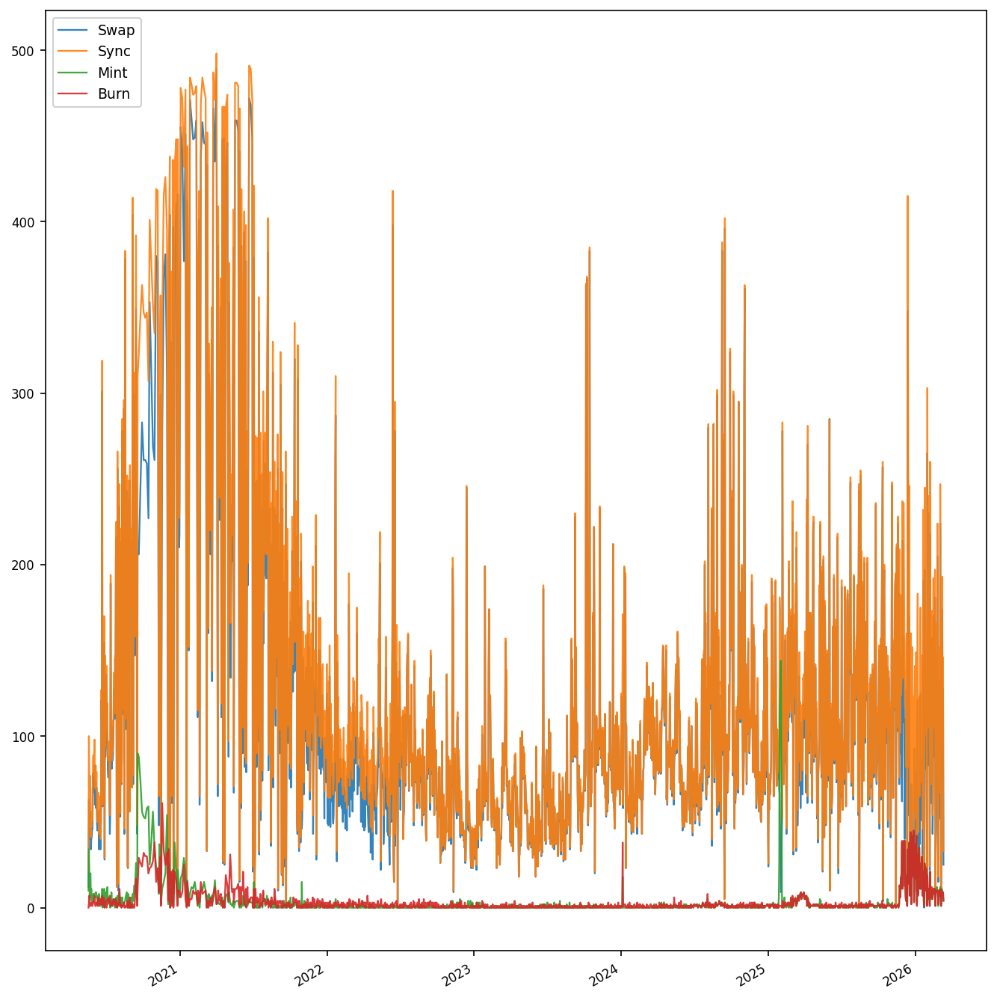

# COMP5566 Project Presentation
## Quantifying Frontrunning Activities on Ethereum and Their Impacts on Marketplace

**Group 1**

---

## 1. Project Brief & Requirements

**Goal**: Collect historical Ethereum DEX transactions, detect frontrunning patterns, quantify adversary profits, and measure market impact on Uniswap V2.

**Steps**

1. Collect historical UniswapV2 logs
2. Detect Frontrunning activities (Displacement, Insertion, Suppression and Aribitrage)
3. Analyze the profits of adversaries

**Pipeline**

```
Dataset Crawler  →   4 MEV Detectors  →  Profit Analyzer  →  Charts + Excel
```

---

## 2. The Data

### 2.1 How we do this

* Dune is paid, and we're not rich.
* Etherscan API is suitable.
  - Free quota
  - Filter `Txs` `logs` based on contract address
  - Has rate limit by we can use multiply accounts for load balance. 

### 2.2 What we have done

* We fetch five popular pairs: 
  * `USDT-USDC` `WETH-DAI` `WETH-USDC` `WETH-USDT` `WETH-WETC`
* Every single   from Uniswap's begining till March, 2026 was downloaded
  - accross **14,639,489** blocks
  - retrieve **2,690,493** logs
  - Use **~8 hours** for smooth collect
  - Uploaded to https://www.kaggle.com/datasets/chickenbilibili/uniswapv2-exchange-history


---

## 3. The Detail of collected Data


- **Who are the real dealer?:** if sender is UniswapV2 router, use `to` address instead
- **Key records:** `block_number` + `timestamp` + `tx_index` + `log_index` + `...`
- **Event** We examined `UniswapV2Pair.sol` and collect four event: `Swap / Sync / Mint / Burn`

<div class="side-by-side-tables">

<div>

<p><strong>By event type</strong></p>
<table>
<thead><tr><th>Logs</th><th>records</th></tr></thead>
<tbody>
<tr><td><strong>Sync</strong></td><td>1,349,490</td></tr>
<tr><td><strong>Swap</strong></td><td>1,315,097</td></tr>
<tr><td><strong>Mint</strong></td><td>13,381</td></tr>
<tr><td><strong>Burn</strong></td><td>12,505</td></tr>
<tr><td><strong>Summary</strong></td><td><strong>2,690,473</strong></td></tr>
</tbody>
</table>

</div>

<div>

<p><strong>By pair</strong></p>
<table>
<thead><tr><th>pair</th><th>records</th></tr></thead>
<tbody>
<tr><td><strong>WETH_USDC</strong></td><td>635,388</td></tr>
<tr><td><strong>WETH_DAI</strong></td><td>569,821</td></tr>
<tr><td><strong>WETH_USDT</strong></td><td>566,975</td></tr>
<tr><td><strong>USDC_USDT</strong></td><td>493,501</td></tr>
<tr><td><strong>WETH_WBTC</strong></td><td>424,788</td></tr>
<tr><td><strong>Summary</strong></td><td><strong>2,690,473</strong></td></tr>
</tbody>
</table>

</div>

<div class="density-chart">

<p><strong>Daily log density (WETH–WBTC)</strong></p>


</div>

</div>


---

## 4. Detection Methods

| Type | Logic | Key Threshold |
| --- | --- | --- |
| **Sandwich (Insertion)** | Buy before victim, sell after — profit from victim's price impact | victim same direction as front-run |
| **Displacement** | Pay higher gas to execute the same trade before victim | gas ratio >= **1.5x** |
| **Arbitrage / Back-run** | Trade opposite direction right after a large swap to capture price gap | trade size > **P90**, within **3 tx** |
| **Suppression** | Flood block with many high-gas txs to crowd out other users | >= **3** swaps, gas >= **3x** median |

**Profit models** ($G = \text{gasPrice} \times 150000 / 10^{18} \times P_{ETH}$):

**Sandwich**: $\quad n_i = \sum \text{out}_i - \sum \text{in}_i$, $\quad \text{Net} = \text{USD}(n_0) + \text{USD}(n_1) - G_f - G_b$

**Displacement**: $\quad \text{Loss} = \text{AMM}(\text{in}_v,\, R_{\text{before}}) - \text{out}_v$, $\quad \text{Net} = \text{USD}(\text{Loss}) - G_f$ $\quad$ (AMM = Uniswap V2 $xy=k$ with 0.3% fee)

**Arbitrage**: $\quad \text{Net} = \text{USD}_{\text{pre}}(\text{out} - \text{in}) - G_b$ $\quad$ (use previous block price as fair reference)

---

## 5. Overall Detection Results

| Type | Events | Key Metric | Proportion |
| --- | --- | --- | --- |
| **Sandwich** | 845 (16.2%) | Net profit: **$194,985** | 21.2% profitable |
| **Displacement** | 758 (14.5%) | Est. profit: **$575,132** | 15.3% profitable |
| **Arbitrage / Back-run** | 3,593 (68.9%) | Net profit: **$9,895,544** | avg $2,754/event |
| **Suppression** | 18 (0.3%) | Median gas premium: **20.5x** | extreme but rare |
| **Total** | **5,214** | **$10.7M+** aggregate | |

- Arbitrage / back-running dominates both in **frequency** and **total profit**
- Sandwich profitability is **highly concentrated** — most attempts lose money on gas
- Suppression is the rarest but shows **extreme** gas competition (median 20.5x)

---

## 6. Sandwich Attack Findings

- **845** events, only **179** profitable (**21.2%**) — profitability highly concentrated
- Gross profit: **$668,920**; Net profit (after gas): **$194,985**
- Avg net: $231; Median net: **-$23** (most attackers lose money on gas)

## 7. Displacement, Arbitrage and Suppression

**Displacement (758 events)** — ordering advantage via gas premium
- Median gas ratio: **3.2x** (P95: 125x); Top frontrunner: **82** events

**Arbitrage / Back-running (3,593 events)** — most frequent pattern
- Net profit: **$9,895,544** (avg **$2,754** per event); Top back-runner: **210** events

**Suppression (18 events)** — rarest but most extreme, median gas premium: **20.5x**

---

## 8. Profit Distribution & Top Attackers

- Profit is **extremely concentrated** — a power-law distribution
- Top **10** back-run events account for **85.1%** of total arbitrage profit ($8.4M / $9.9M)
- Top **50** events account for **94.3%** — the remaining **3,543** events share only **5.7%**

 

---

## 9. Multi-Strategy Entities & Timeline

**5 entities** operate across **all 4 attack types** simultaneously — evidence of sophisticated MEV bots

| Entity | Strategies |
| --- | --- |
| `0x00000000…120e49` | Sandwich + Displacement + Arbitrage + Suppression |
| `0x6b75d8af…009a80` | Sandwich + Displacement + Arbitrage + Suppression |
| `0x3328f7f4…309c49` | Sandwich + Displacement + Arbitrage + Suppression |

**Sandwich timeline**: peak activity in **March 2024** (52 events/month), declining afterward as Flashbots/MEV-Boost shifted MEV extraction off-chain


---

## 10. Market impact
- Sandwich-related blocks show **significantly higher** median gas prices
- **WETH_DAI**, **WETH_WBTC**, **USDC_USDT**: large gas premiums in suspicious blocks
- MEV activity increases gas costs for **all users** in affected blocks
- Entity `0x6b75…80` appears in both back-running and suppression, suggesting **multi-strategy** operation


---

## 11. Project Summary

- Complete pipeline: **collection -> detection -> profit analysis -> visualization**
- Covers all **Project 8 requirements**: Displacement, Insertion, Suppression + bonus Arbitrage
- **5,214 events** detected, **$10.7M+** aggregate adversary profit quantified
- Gas-price analysis confirms MEV raises costs for normal traders

**Deliverables**
- Python source code (fetcher + analysis pipeline)
- Collected datasets (CSV) + 9 analysis charts + Excel workbook
- Markdown report + GitHub repo for reproducibility


## Thank You
